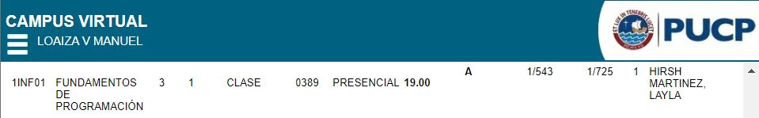
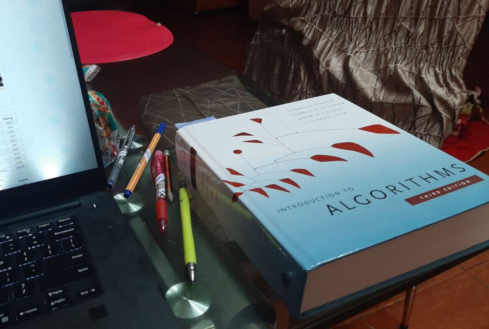
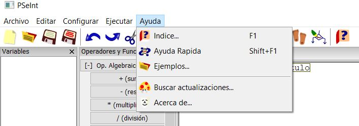
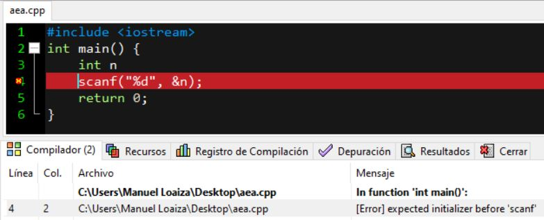
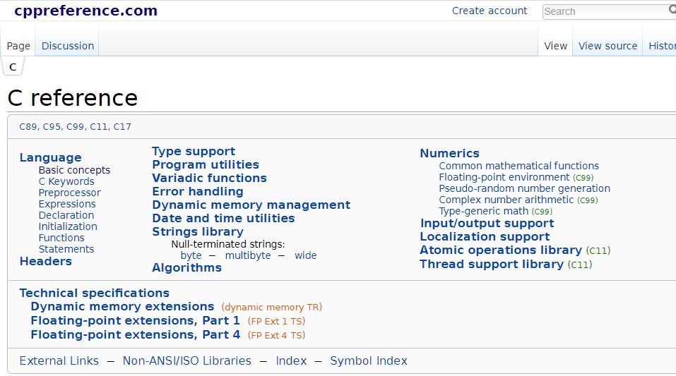

# 1INF01 Fundamentos de Programación

Acabo de terminar Estudios Generales Ciencias y me gustaría compartir este repositorio con recomendaciones para el curso de "funpro", así como mi intento fallido de querer subir el solucionario de todos los problemas de laboratorio (el cual no lo concluí pues los problemas me parecieron repetitivos y aburridos) y una carpeta extra con ciertos problemas que en mi opinión eran bonitos de implementarlos, la mayoría abarcan principios elementales que se ven en los cursos como operaciones matriciales, operaciones con polinomios como derivar o dividir, determinar si un número es primo analizando hasta la raíz y otras cosas más que en su momento me parecieron interesantes (fueron codeados en PSeint pero hice la exportación a C para subir ambas versiones, debido a es, no garantizo que sus versiones en C compilen pues fueron generadas automáticamente). Espero que les sea de utilidad y puedan aprender algo leyendo los códigos o esta especie de reflexión.

# ¿Cómo practicar para el curso?

* Programar es cuestión de práctica, esa es la única manera de internalizar el paradigma que la programación exige, similar al proceso en el cual aprendiste a escribir tus primeras oraciones a los 2 o 3 años.

* Resolver problemas, resolver problemas y resolver más problemas que sean de tu agrado u orientados a tus objetivos. Preferiblemente no resuelvas problemas que sean de exámenes del curso ya que estos son más de lo mismo y, en vez de aprender cosas nuevas, solo estarás mecanizándote en aplicar la misma instrucción una y ota vez, lo cual no te permitirán aprender nuevas técnicas, algoritmos o estructuras. La idea está en que aproveches la base del curso, la cual es adquirir el paradigma de programación, para que puedas aprender por tu cuenta otros temas relacionados y lo apliques a tu vida cotidiana. Puedes ir desarrollando páginas web, aplicaciones móviles, etc. En mi caso particular, yo me dedicaba a aprender algoritmos y estructuras de datos, así como resolver problemas para competencias de programación, para lo cual adquiría la teoría del libro _Introduction to Algorithms, 3rd Edition (The MIT Press)_ y resolvía problemas durante las clases en jueces online como Codeforces.

* Google es tu amigo. Hay que aprender a buscar y leer información en internet o localmente en tu misma computadora. Siempre que alguna amistad tiene alguna duda y me la pregunta, lo primero que digo es "¿Ya leíste (la guía/ ayuda, índice y ejemplos de PSeint/ el error de compilación)?" y casi siempre la respuesta es "No". Esto es algo muy común que no debería ocurrir, pues generalmente las respuestas a sus dudas las tienen en sus manos (en su computadora) incluso sin necesidad de tener conexión a internet, pues lo que he mencionado se encuentra localmente en el IDE que estés usando, no solo te ofrecen ayuda a tu problema sino que hay ejemplos de cómo realizar ciertas instrucciones, declarar variables, funciones, etc (incluso si estás usando terminal en Linux te avisa cuál es el error de compilación). En caso de que hayan respondido "Sí" y tienen conexión a internet, pues tiene que googlear su duda, especialmente en cosas básicas siempre encontrarán la respuesta, ya sea en la misma guía de lenguaje o en foros y páginas como Stack Overflow, Quora, C reference, etc. No conozco a alguien que conozca todo sobre algo relacionado a tecnología, siempre uno termina buscando su solución a problema con ayuda de la comunidad virtual, la cual es muy activa y creo yo que es la principal fuente de aprendizaje respecto a programación, pues es en internet donde he aprendido casi todo lo que sé.

    * Ayuda en PSeInt

    

    * Mensajes en Dev-C++

    

    * Stack Overflow y otras referencias

    

    
